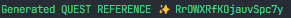
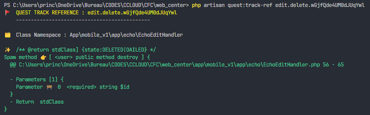

# Quest

Quest, le maître Guru qui simplifie votre quête, il vous donne un itinéraire court à suivre pour atteindre votre objectif (ressource).

Je sais, vous n'avez pas besoin de me mentir 🤥, il vous est souvient arrivé, quand vous faites votre brainstorming (meditation) pour implémenter un fonctionnalité ou récupérer des ressources, de vous demander. Mais... comment est-ce que je vais organiser mes Routes ?

La question des Routes, je ne vous cache pas, moi ca me fout la flemme. Car je doit sois définir un route pour chaques appel, du coup je me retrouve avec des dizaines des Routes défini.

Je sais, nil n'est parfait, ni Quest aussi, mais... il va beaucoup vous simplifier la tâche et fait tombe bas tout ces surcharges mentale, utile mais ennuyant.

## Comment est-ce qu'il m'est utile ?

Quest vous permet d'accédez à des ressources ou d'envoyer vos ressources directement sans vous soucié des Routes. Il vous suffit juste de poser des Flags ou des Marques sur vos méthodes de classes et d'appeler 🤙 c'est méthode directement, avec comme paramètres, les mêmes que celles de la method.

Prenons un exemple, c'est plus simple :
```php
// Code serveur :
class Forest
{
  #[QuestSpaw(ref:'NAhLlRZW3g3Fbh30dZ')]
  function tree(string $color): int
  {
    return $this->fruits();
  }

  function fruits(): int
  {
    return 18;
  }

  #[QuestSpaw(ref: 'RrOWXRfKOjauvSpc7y', method: QuestSpawMethod::GET, jsonResponse: false)]
  function displayAnApples(int $count): View
  {
    //...
  }
}
```

```dart
// Code client :
dio.get("/quest/NAhLlRZW3g3Fbh30dZ", data: {'color': 'green'});
```

```php
// Ou depuis votre fichier view :
route('quest', ['quest_ref' => 'RrOWXRfKOjauvSpc7y', 'count' => 9]);
```

## Comment fonctionne Quest

## Usage

```php
// Dans votre fichier route
Route::get('/', fn() => view('home'));

Quest::spawn(uri: 'quest', routes: [Forest::class]);
```

```php
// Dans votre class
class Forest
{
  #[QuestSpaw(ref:'NAhLlRZW3g3Fbh30dZ')]
  function tree(string $color): int
  {
    return $this->fruits();
  }

  function fruits(): int
  {
    return 18;
  }

  #[QuestSpaw(ref: 'RrOWXRfKOjauvSpc7y', method: QuestSpawMethod::GET, jsonResponse: false)]
  function displayAnApples(int $count): View
  {
    //...
  }
}
```

```dart
// Code client :
dio.get("/quest/NAhLlRZW3g3Fbh30dZ", data: {'color': 'green'});
```

```php
// Ou depuis votre fichier view :
route('quest', ['quest_ref' => 'RrOWXRfKOjauvSpc7y', 'count' => 9]);
```

## Installation

## Commandes CLI

`php artisan quest:generate-ref [36] [--uuid]`



`php artisan quest:track-ref RrOWXRfKOjauvSpc7y`



## Choses à rajouter

- Routes temporaire.
