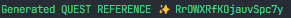
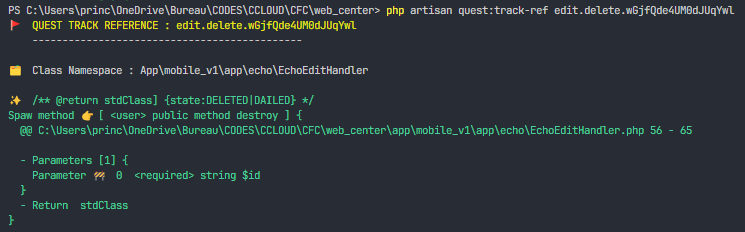
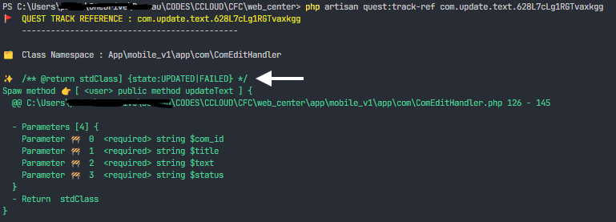

# Quest


Access resources directly without defining routes, thanks to PHP attributes.

[▶️ French (doc) Readme here](./doc/fr.md)

---

- [Introduction](#introdiction)
- [Instalation](#installation)
- [Usage](#usage)
  - [The service container](#service_container)
- [Runnig operation](#fonctionement)
- [API reference](#api_ref)
  - [Quest Spaw (attribut)](#quest_spaw)
  - [Quest Spaw Class (attribut)](#quest_spaw_class)
  - [Quest Router](#quest_route)
  - [Console](#ref_console)
- [FAQ](#faq)

## <span id='introdiction'>🪬Introdiction</span>

Quest, the **Master Guru** which simplifies your quest, it gives you a short route to follow to reach your goal (resource).

I know, you don't need to lie to me 🤥, you have remembered when you are brainstorming to implement a functionality or recover resources and ask you: but ... **how do I will organize my Routes?**

The question of the routes, I do not hide you, me, it fucks the laziness. Because I must be defined a road for any call and suddenly I find myself with many of the defined Routes.

I know, it's not perfect, and neither is **Quest**, but... it will make your job a lot easier and eliminates all that mental overload, useful but boring.

## <span id="installation">✨ Installation</span>

### Prerequisites

- PHP 8.0+
- Laravel minimum 9.x
- Have already made use of the Facade Route. Ex: `Route::get('route/to/x/{param}', fn(string $param) => X)`

### Install Quest from composer

```bash
composer require hacp0012/quest
```

### Publish the config files

Quest needs a few files to work properly.

```bash
php artisan vendor:publish --tag=quest
```

**The file route quest.php**

is a base file that can be useful to you to register your classes. Because the classes registered in this list are public of the second level, because they have a priority that comes after the list passed in your route `Quest:spaw(routes: [])`

> These references are accessible from all requests.

**Experimental**: It is now possible to pass directories, whose base starts from the base directory (of the project) of Laraval.
Very useful if you do not want to specify each time a class that contains your references, You just have to specify a directory or several directories.

>Provided that the punched method is in a class and the class is in a namespace.
_Only the first class is considered in a .php file_.

This file is generated automatically but you can generate it manually.

**The config quest.php**

Contains some settings you can apply if you have made patterns in your project's bootstrap/provider.php for custom targeting of your route files (/routes/web.php or /routes/api.php).

Because Reference Tracker needs to know your targets to track your referenced (punched) methods.

> To publish the configuration files type the command <kbd>php artisan vendor:publish<kbd>

This will create the file `config/quest.php` (which contains some configuration bits) and the global quest routing file in `routes/quest.php`.

_Manually, you can publish the config files like this <kbd>php artisan quest:publish</kbd> in the configs/ and routes/ directory manually._

## 🏳️ How is it useful to me?

Quest allows you to access resources or send your resources directly without worrying about Routes. You just need to set Reference Flags or Reference Marks using PHP attributes on your class methods and call 🤙 these methods directly, with the same parameters as those of the method.

_Don't worry, you just need to respect the same types of parameters that you had defined on your method._

Let's take for example, in a case where you are designing an application and reach a certain level where your application will need to retrieve an up-to-date list of telephone codes. You just have to create a method in a class, reference it and call it; without worrying about creating a route for it.

```php
class PhoneHandler
{
  #[QuestSpaw(ref: 'r84d2S1tM')]
  function getCodes(): array
  {
    //...
  }
}

```

```js
// And call it as this :
axios.get('https://myhost.com/r84d2S1tM');
```

An other exemple :

```php
#[QuestSpaw(ref: 'my quest flag ID', filePocket: 'guidPicture')]
function yogaStage(int $moon, int $sunRise, UploadedFile $guidPicture = null): int
{
  # $guidPicture --> Illuminate\Http\UploadedFile

  return $moon + $sunRise;
}
```

```dart
// So the call will simply be like this:

// Client code :
dio.post("/quest/my quest flag ID", data: {'moon': 2, 'sunRise': 7});
```

Note that Quest takes care of passing parameters to your method. (And you can even pass it a file) as parameters, just give the parameter name to your file. (but you have to report it in filePocket)

## <span id="fonctionement">🚧 How Quest works</span>

Quest is based on PHP attributes. It goes through all your references and creates a registry of the methods you have marked.
A method is marked by a reference key that serves as a reference point for quest to call your method.

To create a reference:

```php
#[QuestSpaw(ref: 'reference.key')]
functiton gong(): array
```

## <span id="usage">🧩 Usage<span>

Let's start by defining our route with Quest:

```php
# In your route file
use Hacp0012\Quest\Quest;

Route::get(uri: '/', action: fn() => view('home')); // Exemple ...

$routes = [
  Forest::class,
  # Or specifie a directory:
  // 'app/demo',
];
Quest::spawn(uri: 'quest', routes: $routes)->name('my.quest');
```

> **`Hacp0012\Quest`** is the main namespace. Contains the `Quest()` class and the `QuestRouter()` class and the `QuestSpawMethod` enum.
> Then there is the namespace **`Hacp0012\Quest\Attributes`**, which contains the Quest attributes. Such as `QuestSpaw()` and `QuestSpawClass()`.

You can add middlewares and such because Quest's static `spawn` function returns an object of type `Illuminate\Routing\Route` so it supports all other methods of the Route facade.

> Note that the `Forest` class has been added to the list of routes in the `spaw(..., routes: [Forest::class])` method.

Let's now define our Forest class which will contain our methods referenced by spaw. _punched_.

```php
// In your class
class Forest
{
  #[QuestSpaw(ref:'NAhLlRZW3g3Fbh30dZ')]
  function tree(string $color): int
  {
    return $this->fruits();
  }

  function fruits(): int
  {
    return 18;
  }

  #[QuestSpaw(ref: 'RrOWXRfKOjauvSpc7y', method: QuestSpawMethod::GET, jsonResponse: false)]
  function displayAnApples(int $count): View
  {
    //...
  }
}
```

And that's it, now you can start calling your methods punched (referenced) by their reference key `ref: 'NAhLlRZW3g3Fbh30dZ'`.

Note that you can use any phrase as a reference. Although quest allows you to generate unique keys. You can use something like: _forest.app.tree.NAhLlRZW3g3Fbh30dZ_. [Or see the CLI command reference for more details](#ref_console)

As in this example above:

```dart
// Code client :
dio.get("/quest/NAhLlRZW3g3Fbh30dZ", data: {'color': 'green'});
```

```php
// Or from your view blad file:

route('my.quest', ['quest_ref' => 'RrOWXRfKOjauvSpc7y', 'count' => 9]);
# It's simple when you have given a name to your route. `->name('quest')`.

```

_`quest_ref` is the parameter key of the route generated by Quest. The kind of parameters that we pass in the url: <https://moonsite.com/my/quest/{quest_ref}>_

🔖 There is another way to call Quest. That is to pass QuestRouter and create a router object, like this:

```php
Route::post('quest/{ref}', function(string $ref) {
  $quest = new QuestRouter(questRef: $ref, routes: [QuestTest::class]);

  return $quest->spawn();
});
```

Or

```php
Route::post('quest/{ref}', function(string $ref) {
  $quest = new Quest;

  $data = $quest->router(questId: $ref, classes: [QuestTest::class]);

  return $data;
});
```

⚠️ Even though this is not the cleanest method, I advise you not to use it because it can give you weird return types that even Laravel's `Service container` won't be able to interpret.

### <span id="service_container">Service container</span>

Laravel provides an automatic dependency injection system that it calls Service Container. It is able to construct an object that you have declared as a parameter.

Take this as a reminder:

```php
Route::get('/', function(Request $request, int $number) {
  // The container service automatically builds $request for you.
});
```

Well Quest can't spoil this happiness. Quest also resolves your objects declared in the parameters.
In any case feel free to do what you want.

🪄 _Try and you will know._ 🧙‍♂️

## <span id="ref_console">👽 CLI Commandes</span>

> `php artisan quest:generate-ref [36] [--uuid]`

Generate a reference key. But this does not prevent you from taking any text for reference. This is just a help, to allow you to do something unique.

_If you add the `--uuid` option, it will generate a UUID key and ignore the length you specified. UUIDs are 36 characters long (they are unique anyway)_

By default the command generates 36 random characters.

<kbd>php artisan quest:generate-ref</kbd>



> `php artisan quest:track-ref [ref-id]`

Track the reference of a pointed method (spawed)

Among the good things, there is the ref tracker. This tracker is great, it allows you to find yourself more easily and find the implementation of your method.

<kbd>php artisan quest:track-ref RrOWXRfKOjauvSpc7y</kbd>



Because let's be serious, the reference key system can be a little more constipating when you don't have a very solid architecture or when you are a beginner. This is why I advise you not to rely only on the keys generated by the `quest:generate-ref` command, get into the habit of adding a few words called **human readable**. Ex. 'my.forest.trees.meXRQbm0WQP6ZpAN5U'

To check the quest version:

> `php artisan about`

_This is an internal command of Laravel_

## <span id="api_ref">🔆 Api reference</span>

### <span id="quest_route">QuestRouter</span>

```php
QuestRouter(protected string $questRef, array $routes = [])
```

- @param string $questRef Reference ID.

- @param array<int, string> $routes An array of spawned class's. But class's listed
here are not visible by the Ref-Tracker in console. The Class referenced here are private to this route.
If `$routes`is not empty, only the global routes`$routes` a accessible. The base routes quest are not quested.

**Routes precedence** :

1. Local routes : defined in spawed $routes parameter.
2. Global Base routes : defined in your routes/quest.php.
3. Defaults Global routes : default quest routes.

### Quest Spaw

Quest Router `QuesetRouter` short hand.

```php
static function spawn(string $uri = 'quest', array $routes = []): Illuminate\Routing\Route
```

Exemple :

```php
Quest::spawn(string $uri = 'quest', array $routes = [QuestTest:class]);

# ⚠️ To use only in route file.
```

@param string $uri

⚠️ At any end of `uri` a `{quest_ref}` route parameter are append. Dont append it twice.

@param array<int, string> $routes An array of spawned class's or directories (paths) started at the Laravel project base path `base_path()`.

### <span id="quest_spaw">QuestSpaw [Attribut]</span>

Create a new Spaw Attribut instance.

```php
QuestSpaw(
  string $ref,
  ?QuestSpawMethod $method       = null,
  string|null $filePocket        = null,
  bool $jsonResponse             = true,
  array|string|null $middleware  = null,
  array $alias                   = [],
)
```

@param string `$ref` Quest identifier. _Can be any text you want to use as an identifier_.

- ⚠️ Avoid to put / (slash) in the ID String.

@param string|null `$filePocket` The name of parameter that will receive file.

- ⚠️ The method parameter name, not an alias name.
- ⚠️ For this version, filePocket reference will receive a single `Illuminate\Http\UploadedFile` file.

@param `QuestSpawMethod|null $method` Http method. supporteds [GET, POST and DELETE]. Default is `QuestSpawMethod::POST`. But you can change this behavior in quest config file.

@param bool `$jsonResponse` The return value will be serealized as Json Response. Set it to `false` if you want to return un serealized data.

@param array|string|null `$middleware` The name or array of middlewares.
🏷️ Not that, the middlware is verified when the method provide a middleware.
If the method middleware a provided and have not matched with route (request) middlewares, the method will
not be called.

@param array<string,string> `$alias` The spawed method aliases parameters names.

- the `key` name is the name of the spawed method parameter and
- the `value` is the alias ot this parameter name.

⚠️ Alias affect the `$filePocket` name. In the filesPccket, use the original parameter name; not an alias.

```php
# Exemple:
#[QuestSpaw(ref: 'RrOWXRfKOjauvSpc7y', alias: ['count'=> 'max_weight', 'state' => 'quality'])]
function displayAnApples(int $count, string $color, string $state): View

// désormais, le nom du paramètre `$count` devient `max_weight`
```

### <span id="quest_spaw_class">QuestSpawClass [Attribut]</span>

Custruct the spawed class instance.

```php
QuestSpawClass(public array $constructWith = [])
```

@param array<string,mixed> $constructWith Is a list of argument to pass to the class constructor.

- ⚠️ Only an _AsscoArray_ are allowed not indexed array.
- ⚠️ Only primitve data are allowed in the constructWith array value.
- 🚧 But you can use the sugar of Laravel Service Container in the class constructor.

```php
# Laravel Service Container Sugar :

#[QuestSpawClass(['age' => 1])]
class person {
 function __construct(Request $request, int $age) {...}
}
```

## Best practices

### The type of return in comment

Let's take this example:

```php
/** @return stdClass {state:UPDATED|FAILED} */
#[QuestSpaw(ref: 'com.update.text.628L7cLg1RGTvaxkgg')]
function updateText(string $com_id, string $title, string $text, string $status): stdClass
{
  $return = new stdClass;

  $state = false;

  // ...

  $return->state = $state ? 'UPDATED' : 'FAILED';

  return $return;
}
```

Please specify the return type and details about it, because the tracker returns the PHP-Doc comments of the method. This will help you to have a direct idea of ​​what is returned by the call.



## Things to add

- Temporary routes.

## <span id="#faq">FAQ</span>

### How can I do my `request` validations ?

First of all the method parameters are also another type of validation but low level.
You can retrieve all your `request parameters` via the `Request` object like this:

```php
function myMethod(Request $request, array $myQueryParams)
{
  $validateds = $request->validate([...], [...]);

  $validateds = request()->validate(...);

  # ...
}
```

> By default, quest supports some basic (native) types `['bool', 'int', 'float', 'string', 'null', 'array', 'mixed', UploadedFile::class]` and the one you linked in Service Container via Provider. Other types are not supported. The reason is that over HTTP(S) we don't often transfer objects. It's often text and often formatted in JSON. So the basic (native) types are often the same types that the JSON annotation supports.
