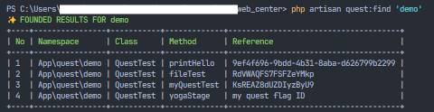

# Commands

## geneate-ref

Generate QUEST REFERENCE.

`php artisan quest:generate-ref [length] [--uuid]`

- length : The length of characters to generate. (Optional | default 36)
- --uuid : Wether to generate UUID enstead to Random string.

## track-ref

Track Quest Reference.

`php artisan quest:track-ref [ref]`

- ref : The quest REFERENCE generated to spaw a ressource.

## publish

Publish quest route file in the routes base folder.

`php artisan quest:publish`

## ref

Reference console manager.

`php artisan quest:ref [--list [--no-table] [--index=n]] [--generate=n] [--track='']`

- `--list` `-l` : Print a list of all references.
  - `--no-table` `-e` Dont print results in a table.
  - `--index` `-i` Show only items of the specified index's. Separate index by comma --index=1,2,4
- `--generate=n` `-g` : Generate a random refernce n is length of characters need to be generated.
- `--g-uuid` `-u` : Generate a unique uuid refernce.
- `--track=''` `-t` : Track a reference.

## find

Very helpful to search a reference via a keyword, a class name, a method, a reference or text in php-doc comments.

`php artisan quest:find keyword [--full] [--with-comments]`

- `keyword` String
- `--with-comments` `-c` Add comments in results.
- `--full` `-f` Show a full details in results.

Exemple:

