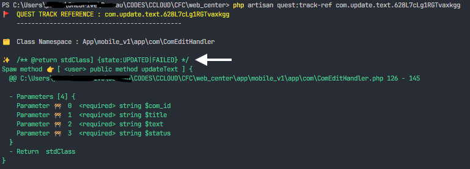

# Quest

Accédez directement aux ressources sans définir des routes

- [Introduction](#introdiction)
- [Instalation](#installation)
- [Usage](#usage)
  - [Le service container](#service_container)
- [Fonctionement](#fonctionement)
- [Api reference](#api_ref)
  - [Quest Spaw](#quest_spaw)
  - [Quest Router](#quest_route)
  - [Console](#ref_console)
- [FAQ](#faq)

## <span id='introdiction'>🪬Introdiction</span>

Quest, le __maître Guru__ qui simplifie votre quête, il vous donne un itinéraire court à suivre pour atteindre votre objectif (ressource).

Je sais, vous n'avez pas besoin de me mentir 🤥, il vous est souvient arrivé, quand vous faites votre brainstorming pour implémenter un fonctionnalité ou récupérer des ressources, de vous demander. Mais... __comment est-ce que je vais organiser mes Routes ?__

La question des Routes, je ne vous cache pas, moi ca me fout la flemme. Car je doit sois définir un route pour chaques appel et du coup je me retrouve avec des dizaines des Routes défini.

Je sais, nil n'est parfait, ni __Quest__ aussi, mais... il va beaucoup vous simplifier la tâche et fait tombe bas tout ces surcharges mentale, utile mais ennuyant.

## <span id="installation">✨ Installation</span>

### Pré-requis

- PHP 8.0+
- Laravel minimum laravl 9.x
- Avoir déjà fais usage de la Facade Route. Ex: `Route::get('chemin/{param}', fn(string $param) => X)`

### Installer Quest depuis composer :

```bash
$ composer require hacp0012/quest
```

### Publier les fichiers de configs

Quest à besoin des quelques fichiers pour bien fonctionner.

```bash
$ php artisan vendor:publish --tag=quest
```

__Le fichier route quest.php__

est un fichier de base qui peut vous être utile pour y enregistrer vos class. Car les classes enregistrés dans cette liste sont publiques du second niveau, car ils ont une priorité qui viens après la liste passé dans votre route `Quest:spaw(routes: [])`

> Ces références sont accessibles depuis toute les requêtes.

Ce fichier est généré automatiquement mais vous pouvez la générer manuellement.

__Le fichier config quest.php__

Contient quelques réglages que vous pouvez appliquer si vous avez fait des motifs dans le bootstrap/provider.php de votre projete pour un ciblage personnalisé des vos fichiers route (/routes/web.php ou /routes/api.php).

Car Traqueur des références doit connaître vos cible pour traquer vos méthodes référencé (poinçonné).

> Pour publier les fichiers de configuration tapez la commande <kbd>php artisan vendor:publish<kbd>

Ceci va crée le fichier `configs/quest.php` (qui contient quelques peux des configuration) et le fichier que routage globale de quest dans `routes/quest.php`

_De façon manuel, vous pouvez publier les fichiers des configs de cette façon <kbd>php artisan quest:publish</kbd> dans le répertoire configs/ et routes/ de façon manuelle._


## 🏳️ Comment est-ce qu'il m'est utile ?

Quest vous permet d'accédez à des ressources ou d'envoyer vos ressources directement sans vous soucié des Routes. Il vous suffit juste de poser des Flags de référence ou des Marques de référence sur vos méthodes de classes et d'appeler 🤙 ce méthode directement, avec comme paramètres, les mêmes que celles de la method.

Ne vous inquiétez pas, il vous suffit juste de respecter les même types de paramètres que vous aviez défini sur votre méthode. Par exemple 

```php
#[QuestSpaw(ref: 'my quest flag ID', filePocket: 'guidPicture')]
function yogaStage(int $moon, int $sunRise, UploadedFile $guidPicture = null): int
{
  # $guidPicture --> Illuminate\Http\UploadedFile

  return $moon + $sunRise;
}

# Donc l'appel sera simplement :

// Code client :
dio.post("/quest/my quest flag ID", data: {'moon': 2, 'sunRise': 7});
```

Remarque que Quest se charge de passer des paramètres à vôtre méthode. (Et vous pouvez même lui passer un fichier) comme paramètres, juste de donner le nom du parcmètre à votre fichier. (mais il faut le signaler dans filePocket)


## <span id="fonctionement">🚧 Comment fonctionne Quest</span>

Quest est basé sur les attributs PHP. Il parcours tout vos références et cré un registre des méthodes que vous avez marqué.
Une méthode est marqué par une clé de référence qui sert à quest comme point de repére pour appeler ma méthode.

Pour crée une référence :

```php
#[QuestSpaw(ref: 'cle.de.reference')]
functiton gong(): array
```

## <span id="usage">🧩 Usage<span>

Commençons par définir nôtre route avec Quest :

```php
# Dans votre fichier route
use Princ\Quest\Quest;

Route::get('/', fn() => view('home')); // Exemple ...

Quest::spawn(uri: 'quest', routes: [Forest::class]);
```

> __`Princ\Quest`__ est le namespace principale. Contient la classe `Quest()` et la classe `QuestRouter()` et l'enum `QuestSpawMethod`.

> Puis il y a le namespace __`Princ\Quest\Attributs`__, qui contient les attributs Quest. Tele que `QuestSpaw()` et `QuestSpawClass()`

Vous pouvez ajouter des middlewares et autres car la fonction `spaw` de Quest renvoi un objer de type `Illuminate\Routing\Route` donc il supporte tout les autres méthodes de la facade Route.

> Noté bien que la class `Forest` a était ajouté dans la liste des routes de la méthode `spaw(..., routes: [Forest::class])`

Définissons maintenent notre class Forest qui va contenir nos méthodes référencé par spaw. _poinconné_.

```php
// Dans votre class
class Forest
{
  #[QuestSpaw(ref:'NAhLlRZW3g3Fbh30dZ')]
  function tree(string $color): int
  {
    return $this->fruits();
  }

  function fruits(): int
  {
    return 18;
  }

  #[QuestSpaw(ref: 'RrOWXRfKOjauvSpc7y', method: QuestSpawMethod::GET, jsonResponse: false)]
  function displayAnApples(int $count): View
  {
    //...
  }
}
```

Et c'est toute, vous pouvez maintenant commencer à appeler vos méthodes poinçonné (référencé) par leur clé de référence `id: 'NAhLlRZW3g3Fbh30dZ'`.

Comme dans cette exemple ci-dessous :

```dart
// Code client :
dio.get("/quest/NAhLlRZW3g3Fbh30dZ", data: {'color': 'green'});
```

Noté bien que vous pouvez utiliser n'importé quel phrase comme référence. même si quest vous permet de générer des clé unique. Vous pouvez utiliser comme par ex: _forest.app.tree.NAhLlRZW3g3Fbh30dZ_. [Ou consulter le référence des commandes CLI pour plus des détails](#ref_console)

```php
// Ou depuis votre fichier view blad:

route('quest', ['quest_ref' => 'RrOWXRfKOjauvSpc7y', 'count' => 9]);
# Il est simple quand vous avez donné un nom à vôtre route. `->name('quest')`.

```

_`quest_ref` est la clé du paramètre du route généré par Quest. le genre de paramètres que l'on passe dans l'url : https://monsite.com/quest/{quest_id}_

🔖 Il y a une autre façon de faire appel à quest. C'est de passer QuestRouter et crée un objet router, de cette façon :

```php
Route::post('quest/{ref}', function(string $ref) {
  $quest = new QuestRouter(questRef: $ref, routes: [QuestTest::class]);

  return $quest->spawn();
});
```

Ou

```php
Route::post('quest/{ref}', function(string $ref) {
  $quest = new Quest;

  $data = $quest->router(questId: $ref, classes: [QuestTest::class]);

  return $data;
});
```

⚠️ Même si celui-ci n'est pas la méthode la plus clean, Je vous déconseillé de l'utiliser car il peut vous pondre des type de retour bizarre que même le `Service container` de Laravel ne saura pas interprété.

### <span id="service_container">Service container</span>

Laravel fourni un système d'injection de dépendance automatique qu'il nomme Service Container. Il est capable de construire un objet que vous avez   déclarez en paramètre.

Prénom ceci comme rappel :

```php
Route::get('/', function(Request $request) {
  // Le service container construits automatiquement $request pour vous.
});
```

Et bien quest ne pouvez pas vous gâchez cette bonheur. Quest résout aussi vos object déclaré dans le paramètres.

Try and you will know.

## <span id="ref_console">👽 Commandes CLI</span>

Générer une clé de référence. Mais cela ne vous empêche pas de prendre n'importe quel text pour référence. Ceci est juste un aide, pour vous permettre de faire quelque chose d'unique.

`php artisan quest:generate-ref [36] [--uuid]`

_Si vous ajoutez l'option `--uuid`, il va générer un clé UUID et ignorer la longueur que vous avez précisé. Les UUID comptant 36 caractères (de toutes façon ils sont unique)_

Par défaut la commande génère 36 caractères aléatoire <kbd>php artisan quest:generate-ref</kbd>


Traquer la référence d'une méthode pointé (spawed)

`php artisan quest:track-ref RrOWXRfKOjauvSpc7y`


Parmis les bonnes choses, il y a le ref tracker. Cet traqueur est génial, il vous permet de vous retrouver plus facilement et trouver l'implémentation de votre méthode.

Car soyons sérieux, le système des clés de référence peut être un peu plus constipants quand on a pas une architecture bien solide ou quand on est débutant. C'est pourquoi je vous conseille de ne pas vous fié non seulement aux clés généré par la commande `quest:generate-ref`, ayez l'habitudes de rajouter quelques mots dites __human readable__. Ex. 'my.forest.trees.meXRQbm0WQP6ZpAN5U'

## <span id="api_ref">🔆 Api reference</span>

### <span id="quest_route">QuestRouter</span>

```php
QuestRouter(protected string $questRef, array $routes = [])
```

- @param string $questRef Reference ID.

- @param array<int, string> $routes An array of spawned class's. But class's listed
here are not visible by the Ref-Tracker in console. The Class referenced here are private to this route.
If `$routes` is not empty, only the global routes `$routes` a accessible. The base routes quest are not quested.

__Routes precedence__ :

1. Local routes : defined in spawed $routes parameter.
2. Global Base routes : defined in your routes/quest.php.
3. Defaults Global routes : default quest routes.

### Quest Spaw

Quest Router `QuesetRouter` short hand.

```php
static function spawn(string $uri = 'quest', array $routes = []): Illuminate\Routing\Route
```

Exemple :

```php
Quest::spawn(string $uri = 'quest', array $routes = [QuestTest:class]);

# ⚠️ To use only in route file.
```

@param string $uri 

⚠️ At any end of `uri` a `{quest_ref}` route parameter are append. Dont append it twice.

@param array<int, string> $routes An array of spawned class's.

### <span id="quest_spaw">QuestSpaw [Attribut]</span>

Create a new Spaw Attribut instance.

```php
QuestSpaw(
  string $ref,
  QuestSpawMethod $method        = QuestSpawMethod::POST,
  string|null $filePocket        = null,
  bool $jsonResponse             = true,
  array|string|null $middleware  = null,
  array $alias                   = [],
)
```

@param string `$ref` Quest identifier. _Can be any text you want to use as an identifier_.

- ⚠️ Avoid to put / (slash) in the ID String.

@param string|null `$filePocket` The name of parameter that will receive file.

- ⚠️ The method parameter name, not an alias name.
- ⚠️ For this version, filePocket reference will receive a single `Illuminate\Http\UploadedFile` file.

@param `QuestSpawMethod $method` Http method.

@param bool `$jsonResponse` The return value will be serealized as Json Response. Set it to `false` if you want to return un serealized data.

@param array|string|null `$middleware` The name or array of middlewares.
🏷️ Not that, the middlware is verified when the method provide a middleware.
If the method middleware a provided and have not matched with route (request) middlewares, the method will
not be called.

@param array<string,string> `$alias` The spawed method aliases parameters names.

- the `key` name is the name of the spawed method parameter and
- the `value` is the alias ot this parameter name.

⚠️ Alias affect the `$filePocket` name. In the filesPccket, use the original parameter name; not an alias.

```php
# Exemple: 
#[QuestSpaw(ref: 'RrOWXRfKOjauvSpc7y', alias: ['count'=> 'max_weight', 'state' => 'quality'])]
function displayAnApples(int $count, string $color, string $state): View

// désormais, le nom du paramètre `$count` devient `max_weight`
```

### QuestSpawClass [Attribut]

```php
QuestSpawClass(public array|null $constructWith = null)
```

@param array<int, mixed>|null `$constructWith` A list of argument to pass to
the class constructor.
Not an _AsscoArray_ only indexed array.

_If parameters are less or more, the class will not be constructed, but methods will be called without class construction.
Be careful when you acceced values that will be constructed before with class constructore._

```php
Ex:
#[QuestSpawClass(constructWith: ['Appels field'])]
class Forest
{
  function __construct(protected string $name) {}
}
```

## Les bonne pratiques

### Le type de retour en commentaire

Prenons cet exemple :

```php
/** @return stdClass {state:UPDATED|FAILED} */
#[QuestSpaw(ref: 'com.update.text.628L7cLg1RGTvaxkgg')]
function updateText(string $com_id, string $title, string $text, string $status): stdClass
{
  $return = new stdClass;

  $state = false;

  // ...

  $return->state = $state ? 'UPDATED' : 'FAILED';

  return $return;
}
```

 Veuillez spécifié le type de retour et les détails le concernant, par ce que le traquer renvoie les commentaires PHP-Doc de la méthode. Ca vous aidera pour une idée direct de ce qui est retourné par l'appel.

 

## Choses à rajouter

- Routes temporaire.

## <span id="#faq">FAQ</span>

### Comment je peux faire mes validations `request` ?

Tout d'abord le paramètres de la méthode sont aussi un type de validation mais de bas niveau.
Vous pouvez récupérer tout vos `request parameters`  via l'objet `Request` de cette façon :

```php
function myMethod(Request $request, array $myQueryParams)
{
  $validateds = $request->validate([...], [...]);

  $validateds = request()->validate(...);

  # ...
}
```
